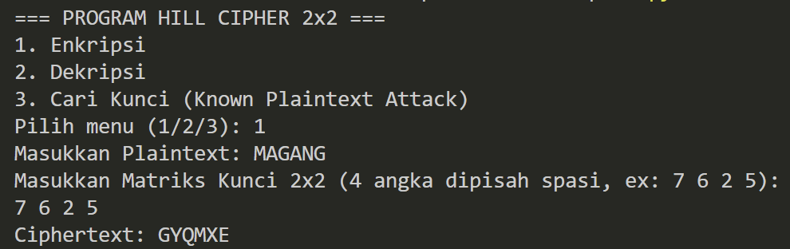
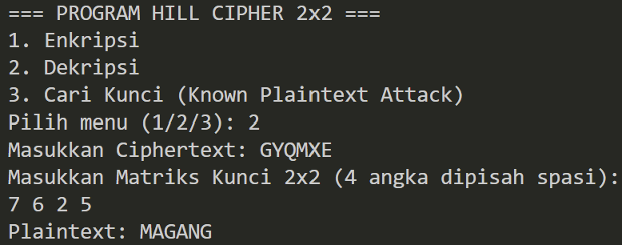
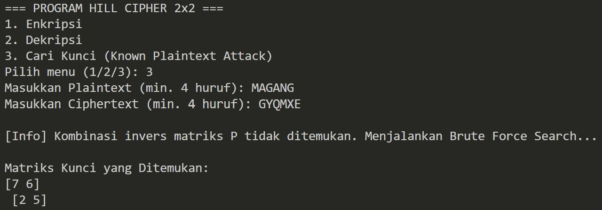

# Program Hill Cipher 2x2

Program Python ini diimplementasikan untuk melakukan **Enkripsi**, **Dekripsi**, dan **Pencarian Kunci (Known Plaintext Attack)** menggunakan algoritma **Hill Cipher matriks 2x2 modulo 26**.
* **File Utama:** `hillcipher.py`
* **Dependensi:** `numpy`

---

## 1. Persiapan dan Cara Menjalankan

Sebelum menjalankan program, pastikan library `numpy` sudah terinstal:

```powershell
pip install numpy
```

Jalankan file program utama melalui terminal:

```powershell
python hillcipher.py
```

## 2. Penjelasan Alur Program

Program ini beroperasi melalui tiga menu utama dengan alur kerja sebagai berikut:

### A. Alur Enkripsi (Menu 1)

* **Input & Persiapan:** Menerima plaintext dan matriks kunci 2x2. Teks diubah menjadi huruf kapital, dihilangkan spasinya, dan ditambahkan padding 'X' di akhir jika jumlah hurufnya ganjil.
* **Proses Matriks:** Teks dipecah menjadi blok berisi 2 huruf. Setiap huruf dikonversi menjadi angka (A=0, B=1, dst).
* **Perhitungan:** Setiap blok angka dikalikan dengan matriks kunci, kemudian di-modulo 26.
* **Output:** Angka hasil perhitungan dikonversi kembali menjadi huruf untuk menghasilkan ciphertext.

### B. Alur Dekripsi (Menu 2)

* **Input & Validasi:** Menerima ciphertext dan matriks kunci. Program memeriksa apakah determinan matriks kunci memiliki invers modulo 26. Jika tidak, proses dibatalkan.
* **Invers Matriks:** Program menghitung matriks invers dari kunci yang dimasukkan.
* **Proses Pembalikan:** Ciphertext dipecah menjadi blok 2 huruf, diubah ke angka, lalu dikalikan dengan matriks invers tersebut dan di-modulo 26.
* **Output:** Angka dikonversi kembali menjadi huruf untuk menghasilkan plaintext asli.

### C. Alur Pencarian Kunci (Menu 3 - Known Plaintext Attack)

* **Pendekatan Aljabar:** Program mengambil blok pasangan huruf dari plaintext dan ciphertext. Jika matriks plaintext memiliki invers modulo 26, matriks kunci langsung dihitung secara matematis.
* **Pendekatan Brute Force (Fallback):** Jika pendekatan aljabar gagal (matriks sampel plaintext tidak memiliki invers mod 26), program otomatis melakukan iterasi kombinasi angka secara menyeluruh (brute force) hingga menemukan matriks kunci yang valid dan cocok.

## 3. Screenshot Running Program

* **Menu 1: Enkripsi**
  Mengubah plaintext `MAGANG` menggunakan matriks kunci `[[7, 6], [2, 5]]` menjadi ciphertext `GYQMXE`.
  
* **Menu 2: Dekripsi**
  Mengembalikan ciphertext `GYQMXE` menggunakan matriks kunci `[[7, 6], [2, 5]]` menjadi plaintext `MAGANG`.
  
* **Menu 3: Cari Kunci (Known Plaintext Attack)**
  Melacak kunci dari pasangan `MAGANG` dan `GYQMXE`. Program mengaktifkan Brute Force Search dan berhasil menemukan kembali matriks kunci `[[7, 6], [2, 5]]`.
  
