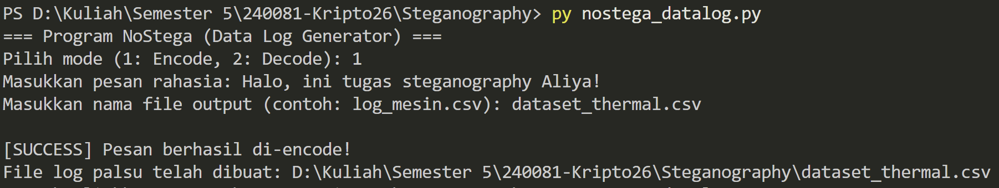
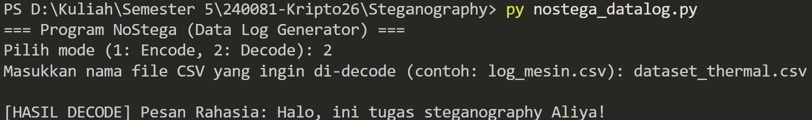

# Tugas 5 - Noiseless Steganography (NoStega)

Repository ini berisi implementasi program **Noiseless Steganography (NoStega)**. Program ini tidak menyisipkan pesan ke dalam file penampung (*cover object*), melainkan secara langsung mengubah teks rahasia menjadi sebuah file mandiri yang terlihat natural (file CSV berisi log pemantauan suhu mesin industri).

## 📌 Penjelasan Alur Program

### 1. Alur Encode (Pembuatan File Kamuflase)
Proses penyandian (menyembunyikan pesan) dilakukan melalui langkah-langkah berikut:
1. **Input Data:** Pengguna memasukkan pesan teks rahasia dan menentukan nama file output (contoh: `log_data.csv`).
2. **Konversi Karakter:** Program memecah pesan menjadi karakter individu dan mengonversinya ke dalam nilai kode ASCII (misalnya karakter 'a' = 97).
3. **Manipulasi Data (Kamuflase):** Nilai ASCII ditambahkan dengan nilai *base temperature* (100) agar angkanya membesar menjadi kisaran suhu mesin industri yang realistis (97 + 100 = 197°C).
4. **Penulisan ke CSV:** Program menyusun baris log untuk setiap karakter pesan yang memuat:
   * **Timestamp:** Waktu log buatan yang diset berjarak 5 menit antar baris.
   * **Sensor_ID:** ID perangkat fiktif yang digenerate secara acak.
   * **Temperature_C:** Nilai kamuflase dari kode ASCII pesan aslinya.

### 2. Alur Decode (Ekstraksi Pesan)
Proses pengungkapan pesan rahasia dilakukan melalui langkah-langkah berikut:
1. **Input File:** Pengguna memasukkan nama file CSV yang merupakan hasil dari proses *encode* sebelumnya.
2. **Pembacaan Baris:** Program membuka file, melewati baris *header*, dan membaca baris data satu per satu secara berurutan.
3. **Isolasi Target:** Program hanya mengambil nilai pada kolom ke-3, yaitu kolom `Temperature_C`.
4. **Restorasi ASCII:** Nilai suhu dikurangi kembali dengan nilai *base temperature* (misal: 197 - 100 = 97).
5. **Konversi ke Teks:** Nilai ASCII (97) dikonversi kembali menjadi teks ('a') menggunakan fungsi pembacaan karakter, lalu seluruh karakter digabungkan menjadi kalimat yang utuh dan ditampilkan kepada pengguna.

## 📸 Screenshot Running Program

**1. Hasil Encode**

**2. Hasil Decode**
