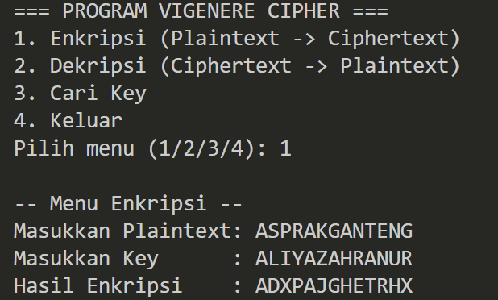
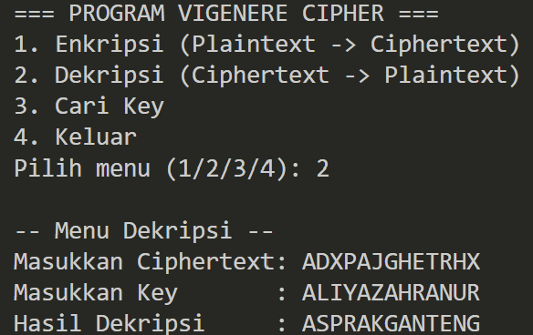
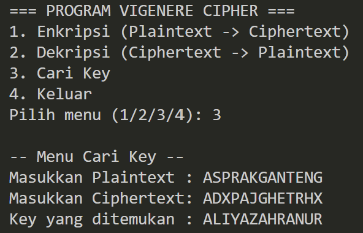

# Program Vigenere Cipher

Program Python ini diimplementasikan untuk melakukan **Enkripsi**, **Dekripsi**, dan **Pencarian Kunci** menggunakan algoritma **Vigenere Cipher modulo 26**.
* **File Utama:** `vigenerecipher.py`
* **Dependensi:** Tidak ada (Standard Python Library)

---

## 1. Persiapan dan Cara Menjalankan

Program ini berjalan menggunakan standar library bawaan Python, sehingga tidak memerlukan instalasi *package* tambahan apa pun. 

Jalankan file program utama melalui terminal atau command prompt:

```powershell
python vigenerecipher.py
```

## 2. Penjelasan Alur Program

Program ini beroperasi melalui antarmuka interaktif CLI (*Command Line Interface*) yang terus berjalan dalam *loop* hingga pengguna memilih untuk keluar. Terdapat tiga fitur utama dengan alur kerja sebagai berikut:

### A. Alur Enkripsi (Menu 1)

* **Input & Persiapan:** Menerima `plaintext` dan `key` dari pengguna. Program secara otomatis akan menghapus seluruh spasi dan mengubah teks menjadi huruf kapital (Uppercase) agar seragam.
* **Proses Pemasangan Key:** Program akan mencocokkan setiap huruf teks dengan huruf pada kunci. Jika kunci lebih pendek dari teks, kunci akan diulang (extend) secara otomatis menggunakan operasi modulus pada indeks string `(i % len(key))`.
* **Perhitungan:** Huruf-huruf diubah menjadi nilai numerik (A=0, B=1, ..., Z=25). Kemudian setiap nilai dieksekusi dengan rumus enkripsi Vigenere: `C = (P + K) mod 26`.
* **Output:** Hasil angka dikonversi kembali ke dalam karakter alfabet ASCII untuk menghasilkan `ciphertext`.

### B. Alur Dekripsi (Menu 2)

* **Input & Persiapan:** Menerima `ciphertext` dan `key`. Format teks kembali diseragamkan (huruf kapital dan tanpa spasi).
* **Proses Pemasangan Key:** Kunci kembali diulang/di-extend agar panjangnya setara dengan jumlah karakter pada `ciphertext`.
* **Perhitungan:** Huruf diubah ke bentuk angka, lalu diproses menggunakan rumus pembalikan dekripsi Vigenere: `P = (C - K) mod 26`.
* **Output:** Angka hasil dekripsi dikonversi menjadi huruf, menghasilkan `plaintext` asli.

### C. Alur Pencarian Kunci (Menu 3)

* **Input & Validasi:** Menerima input `plaintext` dan `ciphertext`. Program akan memvalidasi apakah panjang kedua teks ini sama. Jika berbeda, program akan mengeluarkan pesan *Error*.
* **Perhitungan:** Karena Vigenere beroperasi pada sistem aljabar modular, kunci dapat dicari secara langsung tanpa *brute force*. Setiap huruf pada ciphertext dan plaintext (dalam bentuk angka 0-25) dihitung selisihnya menggunakan rumus: `K = (C - P) mod 26`.
* **Output:** Mengeluarkan urutan huruf yang menyusun kunci yang digunakan pada proses enkripsi.

## 3. Screenshot Running Program

* **Menu 1: Enkripsi**
  Mengubah plaintext `ASPRAKGANTENG` menggunakan kunci `ALIYAZAHRANURAZIZAH` menjadi ciphertext `ADXPAJGHETRHX`.
  

* **Menu 2: Dekripsi**
  Mengembalikan ciphertext `ADXPAJGHETRHX` menggunakan kunci `ALIYAZAHRANURAZIZAH` menjadi plaintext `ASPRAKGANTENG`.
  

* **Menu 3: Cari Kunci**
  Melacak kunci asli dari pasangan plaintext `ASPRAKGANTENG` dan ciphertext `ADXPAJGHETRHX`. Program mengeksekusi rumus pencarian dan berhasil menemukan pola kunci `ALIYAZAHRANUR` (kunci dasar yang terpotong sepanjang plaintext).
  